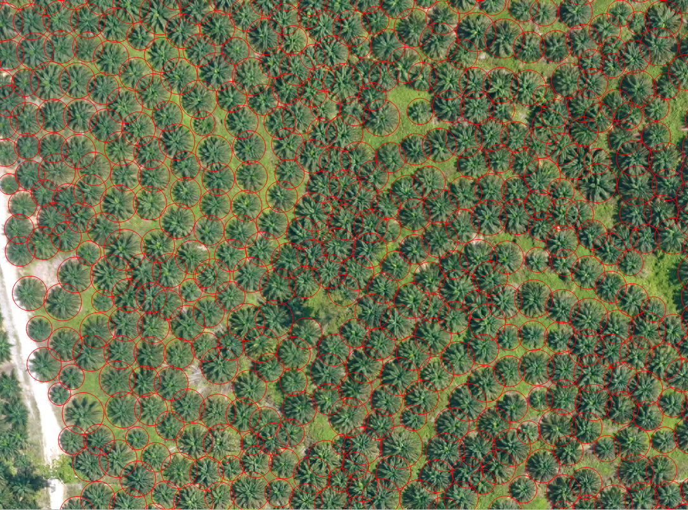
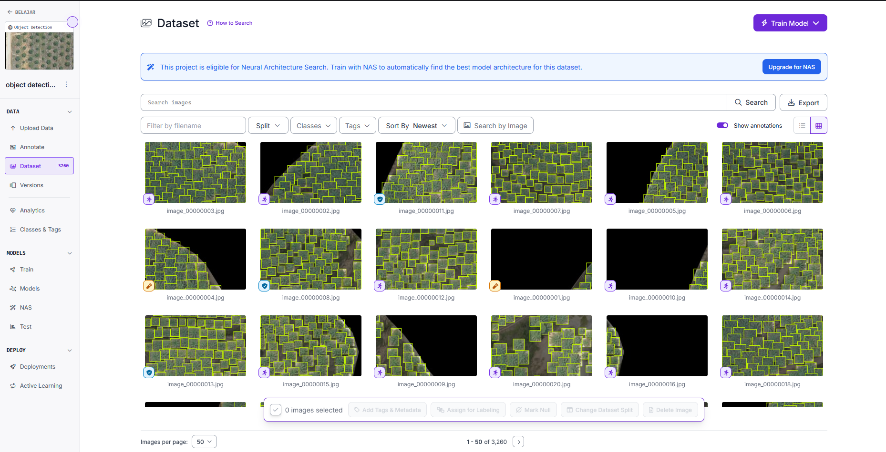
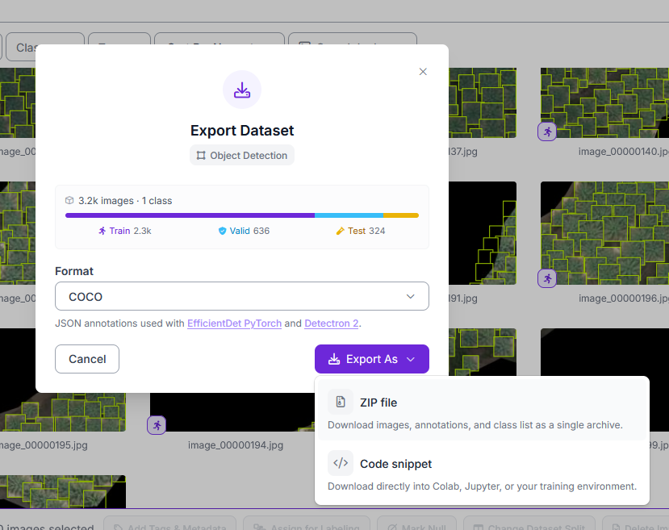
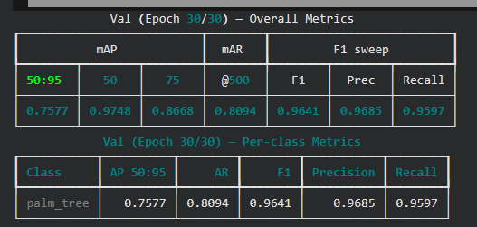

+++
title = 'How to Train RF-DETR for Oil Palm Tree Detection in Aerial Imagery'
date = 2026-07-29T21:32:59+07:00
draft = false
+++

RF-DETR adalah model object detection berbasis transformer yang dapat digunakan untuk mendeteksi dan mengenali objek pada suatu gambar. Dalam artikel ini, saya akan membahas proses training RF-DETR menggunakan dataset kustom, mulai dari persiapan dataset hingga menghasilkan model yang siap digunakan, khususnya dalam bidang geospasial. Studi kasus yang digunakan adalah deteksi pohon kelapa sawit pada _aerial imagery_ atau citra udara.

Berdasarkan benchmark, RF-DETR <a href="https://blog.roboflow.com/best-object-detection-models/" target="_blank" rel="noopener noreferrer">lebih unggul</a> dibandingkan model object detection lain, seperti YOLO11 dan YOLO26. Untuk mempelajari RF-DETR lebih lanjut, dokumentasi dan source code-nya dapat dilihat di <a href="https://github.com/roboflow/rf-detr" target="_blank" rel="noopener noreferrer">repositori GitHub resmi RF-DETR</a>.

## Understanding the Workflow

Secara umum, alur yang saya gunakan adalah sebagai berikut:

**1. Persiapan dataset:**

- Citra yang akan dijadikan dataset.
- Hasil digitasi objek (dalam hal ini, pohon kelapa sawit).

**2. Preparing the Annotations:**

- Konversi hasil digitasi (`.shp`, `.geojson`, dll.) ke format COCO.
- Pembagian dan pemilahan dataset.

**3. Training RF-DETR:**

- Choosing the RF-DETR Model Variant.
- Configuring the Training Parameters.
- Monitoring Training Metrics.

**4. Running Inference**

**5. Exporting Detection Results**

## Preparing the Dataset

Tahap pertama adalah menyiapkan citra yang akan digunakan sebagai dataset. Pada proyek ini, citra berasal dari data orthomosaic area perkebunan kelapa sawit.

Selain citra, proses ini juga membutuhkan data hasil digitasi objek pohon kelapa sawit. Digitasi dilakukan menggunakan QGIS dengan membuat bounding box pada setiap pohon yang terlihat pada citra. Hasil digitasi kemudian disimpan dalam format data vektor. Jangan lupa untuk mengisi atribut `class` pada data vektor. Dalam hal ini, saya menambahkan atribut `class` dan mengisinya dengan `palm_tree`.

Dari tahap ini, terdapat dua data utama:

1. Citra orthomosaic perkebunan kelapa sawit dalam format `orthomosaics.tif`.
2. Data vektor hasil digitasi pohon kelapa sawit dalam format `vector_dataset.geojson`.

Karena citra orthomosaic memiliki ukuran dan resolusi yang cukup besar, citra tersebut tidak dapat langsung digunakan dalam proses training. Orthomosaic perlu dipotong menjadi beberapa tile berukuran lebih kecil. Pada saat yang sama, bounding box pada data vektor juga perlu disesuaikan dengan posisi objek pada masing-masing tile.

Proses pemotongan citra, penyesuaian bounding box, dan konversi anotasi dilakukan menggunakan beberapa library seperti GeoPandas, Rasterio, NumPy, dan lainnya.

Berikut adalah cuplikan script Python yang dapat Anda gunakan sebagai referensi. Script lengkapnya juga dapat dilihat dan dijalankan melalui .



## Importing the COCO Dataset to Roboflow

Setelah proses pemotongan citra dan konversi anotasi selesai, dataset disimpan dalam bentuk file ZIP dengan format COCO. Di dalam file tersebut terdapat kumpulan image tile dan file anotasi JSON yang menyimpan informasi mengenai ukuran gambar, kategori objek, serta koordinat bounding box pada setiap citra.

File ZIP kemudian diimpor ke Roboflow sebagai sebuah object detection project. Karena proses anotasi sebelumnya telah dilakukan melalui QGIS, Roboflow tidak digunakan untuk membuat bounding box dari awal. Pada tahap ini, Roboflow digunakan untuk memeriksa hasil konversi, mengelola dataset, dan memastikan bahwa setiap anotasi telah terhubung dengan gambar yang sesuai.

Setelah proses import selesai, beberapa hal perlu diperiksa:

1. Bounding box berada tepat pada objek pohon kelapa sawit.
2. Tidak terdapat bounding box yang bergeser atau terpotong secara tidak wajar.
3. Nama kelas sudah konsisten, misalnya `palm_tree`.
4. Tidak terdapat gambar kosong atau rusak.
5. Jumlah gambar dan anotasi sesuai dengan hasil konversi.

Pemeriksaan visual penting dilakukan karena kesalahan pada proses konversi koordinat dapat menyebabkan bounding box bergeser dari posisi objek sebenarnya. Jika ditemukan kesalahan, dataset sebaiknya diperbaiki terlebih dahulu sebelum digunakan untuk training.

Setelah dataset dinyatakan valid, gambar dapat dipilah dan dibagi menjadi tiga bagian, yaitu training set, validation set, dan testing set. Training set digunakan untuk melatih model, validation set digunakan untuk memantau performa model selama training, sedangkan testing set digunakan untuk mengevaluasi kemampuan model pada data yang belum pernah dilihat sebelumnya.

Sebagai contoh, dataset dapat dibagi dengan komposisi:

- 70% training.
- 20% validation.
- 10% testing.

Komposisi tersebut tidak bersifat mutlak dan dapat disesuaikan dengan jumlah data yang tersedia. Hal yang lebih penting adalah memastikan bahwa setiap subset memiliki variasi kondisi citra yang cukup representatif.

Setelah pembagian dataset selesai, dataset dapat diekspor kembali dari Roboflow menggunakan format COCO. File hasil ekspor inilah yang kemudian digunakan untuk proses training RF-DETR di Google Colab.

## Configuring and Training RF-DETR

Setelah dataset siap dalam format COCO, proses training dilakukan menggunakan Google Colab dengan dukungan GPU. Varian model yang lebih kecil cocok digunakan untuk eksperimen awal karena lebih cepat dan membutuhkan memori lebih sedikit. Sementara itu, varian yang lebih besar membutuhkan resource dan waktu training yang lebih besar.

Beberapa parameter utama juga perlu dikonfigurasi, seperti jumlah epoch, batch size, learning rate, resolusi gambar, lokasi dataset, dan folder output. Konfigurasi tersebut harus disesuaikan dengan kapasitas GPU agar proses training dapat berjalan stabil.



Pada proses ini, saya menggunakan RF-DETR Nano dan melatih model selama 30 epoch. Dengan GPU NVIDIA T4 yang tersedia di Google Colab, proses training membutuhkan waktu kurang lebih lima jam. Hasil training sebaiknya disimpan langsung ke Google Drive agar file model, checkpoint, dan output lainnya tidak hilang ketika sesi Google Colab berakhir atau runtime terputus.

Berikut adalah hasil evaluasi RF-DETR Nano setelah 30 epoch pada validation set.

Setelah proses training selesai, model terbaik tersimpan dalam file `checkpoint_best_total.pth`. File tersebut berisi bobot yang telah dipelajari RF-DETR selama proses training dan dapat digunakan untuk mendeteksi pohon kelapa sawit pada citra lain.

## Running Inference dan Export Hasil

Salah satu tantangan dalam penggunaan RF-DETR adalah belum tersedianya plugin QGIS yang dapat langsung memuat dan menjalankan inference dari model tersebut. Sebelumnya, saat menggunakan YOLO, saya dapat menjalankan proses inference dengan lebih mudah melalui plugin <a href="https://qgis-plugin-deepness.readthedocs.io/en/latest/#" target="_blank" rel="noopener noreferrer">Deepness</a> karena model dapat langsung dimuat dan dijalankan pada layer raster di antarmuka QGIS.

Untuk RF-DETR, saya menggunakan beberapa library Python untuk memuat file `checkpoint_best_total.pth`, membaca citra, menjalankan inference, serta mengolah hasil deteksi. Script Python lengkapnya dapat dilihat dan dijalankan melalui .

Sebagai alternatif, khususnya untuk citra geospasial, inference juga dapat dilakukan menggunakan modul RF-DETR dari <a href="https://opengeoai.org/rfdetr/" target="_blank" rel="noopener noreferrer">OpenGeoAI</a>. Modul ini menyediakan workflow yang lebih praktis untuk tiled inference serta mengubah hasil deteksi menjadi data vektor yang dapat ditampilkan kembali di QGIS.



## Implementasi Model


